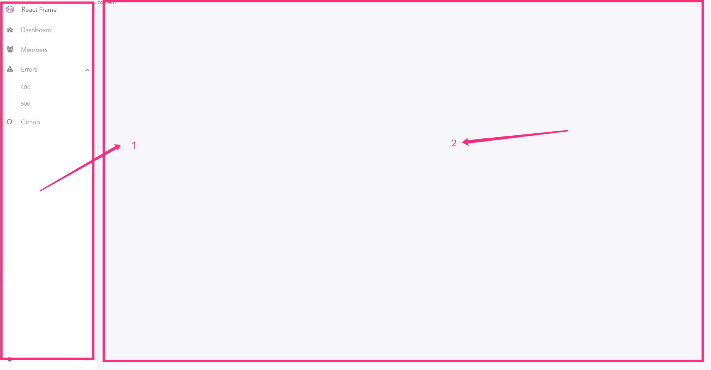

# React Frame

基于 Rsuite 封装的 Frame 结构。

`<Frame>` 包含：

- `<Frame.Nav>` 显示侧边栏。包括产品列表、左侧菜单栏。其中菜单栏需要由使用者自行传入
- `<Frame.Content>` Content 内容区域

## Demo
[Demo](https://rsuite.github.io/react-frame/)

## 用法

**安装**

```
yarn add @rsuite/react-frame

// 或
npm install @rsuite/react-frame
```

**引入 less**

```less
@import '~@rsuite/rsuite-frame/lib/styles/less/index.less';
```


**在代码中引入**

```js
import Frame from '@rsuite/rsuite-frame';
```

### Demo

Frame 结构如下：


其中 Frame 固定的是 1、2 部分。使用者可以自行传入菜单栏和 content 内容。

```js
<Frame>
  <Frame.Nav
    logo={this.getLogo()}
    iconName="DMP-color"
    expand={expand}
    activeName="Insight"
  >
    // 这里是菜单栏的代码
  </Frame.Nav>
  <Frame.Content>content</Frame.Content>
</Frame>
```
具体 Demo code 可以参考 [https://github.com/rsuite/react-frame/blob/master/docs/index.js](https://github.com/rsuite/react-frame/blob/master/docs/index.js)。
## Props

## `<Frame>`

| Name      | Type       | Description |
| --------- | ---------- | ----------- |
| children  | React.Node |             |
| className | string     |             |
| style     | Object     |             |

## `<Frame.Nav>`

| Name              | Type       | Description                  |
| ----------------- | ---------- | ---------------------------- |
| brand             | React.Node | 侧边栏收起状态下显示的 Icon  |
| children          | React.Node |                              |
| className         | string     |                              |
| expand            | boolean    | (受控)侧边栏的是否展开的状态 |
| onExpand          | () => void | 侧边栏展开关闭回调           |
| onRenderBottomNav | ()=> void  | 底部侧边栏渲染方法           |
| renderTitle       | () => any  | 标题                         |
| showMenu          | boolean    | 是否隐藏菜单                 |
| style             | Object     |                              |


## `<Frame.Content>`

| Name      | Type       | Description |
| --------- | ---------- | ----------- |
| children  | React.Node |             |
| className | string     |             |
| style     | Object     |             |
